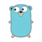

# Go Lunch & Learn



## Overview

Released in 2012 by Google.

Go is an attempt to **combine** the **ease** of programming of an interpreted, dynamically typed language with the **efficiency** and **safety** of a statically typed, compiled language.

Simple to learn and concise (25 **keywords** only).

Built for [concurrency and parallelism](concurrency1.md).

## Deep dive

- [Hello world](main/helloworld.go)
- [Variables](main/variables.go)
- [Functions](main/functions.go)
- [Defer](main/defer.go)
- [Conditions](main/conditions.go)
- [Loops](main/loops.go)
- [Pointers](main/pointers.go)
- [Structures](main/structures.go)
- [Arrays](main/arrays.go)
- [Slices](main/slices.go)
- [Maps](main/maps.go)
- [Methods](main/methods.go)
- [Interfaces](main/interfaces.go)
- [Errors](main/errors.go)
- [Panic](main/panic.go)
- [Goroutines](main/goroutines.go)
- [Channels](main/channels.go)
- [Testing & Profiling](calculator/calculator_test.go)

## Merge sort problem

```go
func mergeSort(s []int) {
	len := len(s)

	if len > 1 {
		middle := len / 2
		mergeSort(s[:middle])
		mergeSort(s[middle:])

		merge(s, middle)
	}
}

/*
Example: 1, 4, 2, 3 => 1, 2, 3, 4
*/
func merge(s []int, middle int) {
	// Merge two halves
}
```